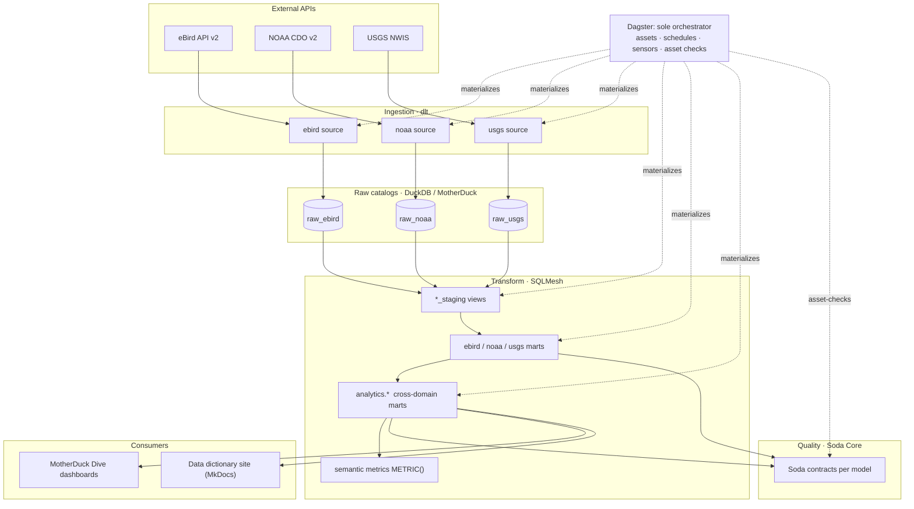
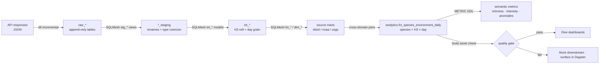

# Databox

[](https://github.com/Doctacon/databox/actions/workflows/ci.yaml)
[](https://doctacon.github.io/databox/)
[](https://www.python.org/)
[](pyproject.toml)
[](pyproject.toml)
[](LICENSE)

A single-operator data platform that ingests three public APIs (eBird,
NOAA, USGS) into one queryable cross-domain warehouse. Zero always-on
infra: file-based DuckDB locally, MotherDuck cloud with one environment
flag. Every layer — ingest, transform, quality, orchestration, semantic
metrics, data dictionary — is wired end-to-end through the same
open-source stack.

The project exists to answer one question: *"do species distributions
shift with same-day weather and streamflow anomalies?"* The platform
around it exists to answer that question honestly, repeatably, and
with receipts.

## Evaluate this repo in ten minutes

1. Skim the **System architecture** diagram below.
2. Skim the **Data flow** diagram below.
3. Open the **[data dictionary](https://doctacon.github.io/databox/)** —
   every model, columns, types, Soda checks, lineage.
4. Read **[ADR-0001 through ADR-0006](docs/adr/)** for the six load-bearing
   architectural decisions.
5. Read **[docs/analytics-examples.md](docs/analytics-examples.md)** to see
   what the cross-domain mart actually answers.

## System architecture



## Data flow



## What this demonstrates

Each claim is backed by a ticket and its evidence, not just prose.

| Capability | How it shows up | Evidence |
|---|---|---|
| **Cross-domain modeling** — joining bird, weather, and streamflow at a shared spatial grain | `analytics.fct_species_environment_daily` keyed on `(species_code, h3_cell, obs_date)`, H3 cells resolve spatial joins across domains | [ticket:flagship-cross-domain-mart](.loom/tickets/20260420-7g33iy2i-flagship-cross-domain-mart.md) · [example queries](docs/analytics-examples.md) |
| **Semantic metrics layer** — one canonical SQL definition per KPI | Seven metrics in `transforms/main/metrics/flagship.sql`, queryable by name via `resolve_metric_query()` | [ticket:semantic-metrics-layer](.loom/tickets/20260420-ah4djnga-semantic-metrics-layer.md) · [metrics docs](docs/metrics.md) · [design record](.loom/research/20260421-semantic-metrics-approach.md) |
| **Contract-based quality** — every model has a Soda contract gated as a Dagster asset check | `soda/contracts/` + Soda asset checks that block downstream materialization on failure | [ticket:observability-pass](.loom/tickets/20260420-wvp3m9gt-observability-pass.md) · [contracts doc](docs/contracts.md) |
| **Schema-contract CI gate** — breaking changes to contracts require explicit opt-in | `scripts/schema_gate.py` runs on PRs, blocks column drops / type narrowings without `accept-breaking-change` marker | [ticket:schema-contract-ci](.loom/tickets/20260420-bsha1b91-schema-contract-ci.md) |
| **Auto-generated data dictionary** — every model's columns, types, checks, and lineage discoverable without cloning | [doctacon.github.io/databox](https://doctacon.github.io/databox/), regenerated from `sqlmesh.Context` + Soda YAML | [ticket:data-dictionary-site](.loom/tickets/20260420-2ikjh1e2-data-dictionary-site.md) |
| **Idempotent incremental ingest** — reruns do not double-count | `write_disposition='merge'` on the right resources, primary keys declared, documented contract | [ticket:incremental-load-audit](.loom/tickets/20260420-c1ogpdel-incremental-load-audit.md) · [incremental-loading doc](docs/incremental-loading.md) |
| **Portable local ↔ cloud** — identical SQL, environment-variable switch | `DATABOX_BACKEND=local` vs `=motherduck`; gateways mirror; settings return file paths vs `md:` URIs transparently | [ADR-0006](docs/adr/0006-motherduck-as-cloud-path.md) |
| **Single orchestration surface** — Dagster owns every run, no CLI drift | Every asset (ingest, transform, quality) visible in one DAG; `task` targets are thin wrappers | [ADR-0005](docs/adr/0005-dagster-as-sole-orchestrator.md) |

## Stack

- **[dlt](https://dlthub.com/)** — Python-native ingestion, auto-schema inference
- **[SQLMesh](https://sqlmesh.com/)** — SQL transforms with virtual environments, native metrics, column-level change detection (see [ADR-0002](docs/adr/0002-sqlmesh-over-dbt.md))
- **[DuckDB](https://duckdb.org/)** — embedded analytical warehouse (see [ADR-0001](docs/adr/0001-duckdb-as-primary-warehouse.md))
- **[MotherDuck](https://motherduck.com/)** — cloud DuckDB for the portfolio deploy (see [ADR-0006](docs/adr/0006-motherduck-as-cloud-path.md))
- **[Dagster](https://dagster.io/)** — sole orchestrator; assets, schedules, sensors, asset checks (see [ADR-0005](docs/adr/0005-dagster-as-sole-orchestrator.md))
- **[Soda Core](https://www.soda.io/soda-core)** — contract-based quality, run as asset checks
- **[MkDocs-Material](https://squidfunk.github.io/mkdocs-material/)** — auto-generated data dictionary site

## Architectural decisions

Six backfilled ADRs (Nygard format) cover the choices that load-bear on
the rest of the design. Each one is under 200 lines.

- [ADR-0001](docs/adr/0001-duckdb-as-primary-warehouse.md) — DuckDB as the primary warehouse
- [ADR-0002](docs/adr/0002-sqlmesh-over-dbt.md) — SQLMesh over dbt
- [ADR-0003](docs/adr/0003-single-sqlmesh-project.md) — Single SQLMesh project across all sources
- [ADR-0004](docs/adr/0004-per-source-raw-catalogs.md) — Per-source raw DuckDB catalogs
- [ADR-0005](docs/adr/0005-dagster-as-sole-orchestrator.md) — Dagster as the sole orchestrator
- [ADR-0006](docs/adr/0006-motherduck-as-cloud-path.md) — MotherDuck as the cloud path

## Quickstart

```bash
# Install (requires uv)
task install

# Configure API keys — EBIRD_API_TOKEN and NOAA_API_TOKEN are free
cp .env.example .env && $EDITOR .env

# Run everything headlessly (ingest → transform → quality)
task full-refresh

# Or interactive: Dagster UI at localhost:3000
task dagster:dev

# Edit a model? Propose in dev, verify, promote to prod
task plan:dev      # materialize into ebird__dev, noaa__dev, ...
task verify:dev    # Soda contracts run against __dev schemas
task plan:prod     # promote verified changes — see docs/environments.md

# Launch the Streamlit data explorer
task streamlit
```

Dagster is the one entrypoint — individual pipeline runs, quality checks,
schedules, and sensors all happen as assets in the same DAG. See
[ADR-0005](docs/adr/0005-dagster-as-sole-orchestrator.md).

Per-mart staleness SLAs are declared in each domain module and validated
by `last_update` asset checks; a sensor emits a structured warning line
per violation. See [docs/freshness.md](docs/freshness.md).

Daily MotherDuck / local usage and cost snapshots land in
`analytics.mart_cost_summary` and auto-render to
[docs/cost.md](docs/cost.md). See that page for the cost model and how to
update the hardcoded MotherDuck rate when pricing changes.

Four production-failure scenarios — blown DuckDB file, partial source
backfill, MotherDuck point-in-time recovery, paused-schedule resumption
— have copy-pasteable recovery commands in
[docs/runbook.md](docs/runbook.md).

## Forking

Databox is designed to be forked. After cloning:

```bash
task init -- \
  --name Weatherbox --slug weatherbox \
  --org your-org --repo weatherbox \
  --site-url https://your-org.github.io/weatherbox/
```

`task init` reads `scaffold.yaml`, rewrites every project-identity reference across README/mkdocs/docs/LICENSE/pyproject, and is a no-op on second run. The three example sources (eBird / NOAA / USGS) stay wired so the whole pipeline is green on day one — delete or replace them at your own pace.

See **[docs/template.md](docs/template.md)** for the full list of what's covered, what stays unchanged (Python package name, external deps), and how to extend the scaffold.

## Backends

Flip between local and cloud via environment variables; the SQL never
changes.

```bash
# Local (default) — file-based DuckDB, zero infra
DATABOX_BACKEND=local

# MotherDuck cloud — same SQL, md:* URIs
DATABOX_BACKEND=motherduck
MOTHERDUCK_TOKEN=<your_token>
```

`databox.config.settings` is the single source of truth: DuckDB paths,
MotherDuck URIs, SQLMesh gateway selection, and the Soda datasource
are all derived from `DATABOX_BACKEND`. See
[docs/configuration.md](docs/configuration.md),
[docs/secrets.md](docs/secrets.md),
[ADR-0001](docs/adr/0001-duckdb-as-primary-warehouse.md),
[ADR-0004](docs/adr/0004-per-source-raw-catalogs.md),
[ADR-0006](docs/adr/0006-motherduck-as-cloud-path.md).

## Repository layout

```
packages/                  # uv workspace
├── databox/               # Shared library (config / quality / orchestration)
└── databox-sources/       # dlt ingestion + per-source configs

transforms/main/           # Unified SQLMesh project (ADR-0003)
├── config.yaml            # local + motherduck gateways
├── metrics/               # semantic metrics registry
└── models/
    ├── ebird/  noaa/  usgs/   # staging → intermediate → marts
    └── analytics/             # cross-domain marts

soda/contracts/            # One Soda contract per SQLMesh model

docs/
├── adr/                   # 6 backfilled ADRs
├── dictionary/            # Auto-generated by scripts/generate_docs.py
└── {metrics,contracts,...}.md

scripts/
├── generate_docs.py       # Data-dictionary generator
├── generate_staging.py    # Staging-SQL codegen from Soda contracts
├── schema_gate.py         # CI breaking-change gate
└── check_source_layout.py # Source-layout convention lint

data/                      # DuckDB files (gitignored)
```

Adding a source? See [docs/source-layout.md](docs/source-layout.md) for the required on-disk shape (enforced in CI by `source-layout-lint`).

## Published artifacts

- **Data dictionary + lineage:** https://doctacon.github.io/databox/ — regenerates on every push to `main`
- **[docs/metrics.md](docs/metrics.md)** — semantic metrics registry and `resolve_metric_query` helper
- **[docs/analytics-examples.md](docs/analytics-examples.md)** — representative queries against the flagship mart
- **[docs/contracts.md](docs/contracts.md)** — Soda contract conventions + schema-contract gate escape hatch
- **[docs/incremental-loading.md](docs/incremental-loading.md)** — per-resource write disposition, keys, backfill

## Observability

Two surfaces ship in-tree: the Dagster UI (asset graph, asset checks,
freshness panel) and the auto-generated data dictionary at
https://doctacon.github.io/databox/.

For external lineage catalogs, Dagster attaches an OpenLineage-emitting
sensor when `OPENLINEAGE_URL` is set in `.env`. Every major catalog
(Marquez, DataHub, OpenMetadata, Atlan, Astro) speaks OpenLineage, so
forkers drop whichever URL they already have and restart Dagster — no
code change. Install with `uv sync --package databox --extra lineage`.
Full walkthrough + local Marquez docker-compose in
[docs/observability.md](docs/observability.md).

## Development

```bash
task install         # Install dependencies (uv sync + pre-commit hook)
task verify          # Smoke full-refresh via Dagster (DATABOX_SMOKE=1)
task ci              # Ruff + mypy + pytest + secret scan
```

Raw lint / format / test / SQLMesh / Dagster CLIs are in
[docs/commands.md](docs/commands.md). `Taskfile.yaml` deliberately
keeps only targets that compose multiple commands or inject env vars.

## License

MIT — see [LICENSE](LICENSE).
