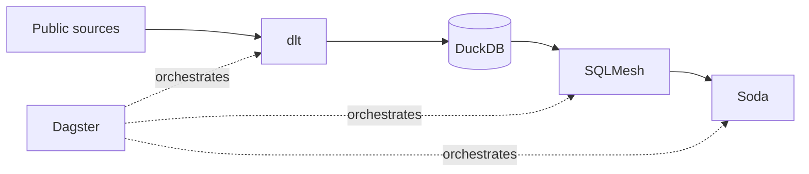
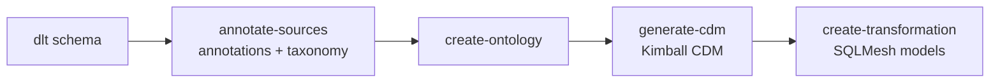

# Databox

[](https://github.com/Doctacon/databox/actions/workflows/ci.yaml)
[](https://doctacon.github.io/databox/)
[](LICENSE)

A local-first data warehouse built around DuckDB. Databox ingests public data
with dlt, transforms it with SQLMesh, validates it with Soda, and orchestrates
everything in Dagster—without always-on infrastructure.



## From source to model

New dlt sources move through a reviewable, agent-guided modeling workflow:



The project skills—[`annotate-sources`](.pi/skills/annotate-sources/SKILL.md),
[`create-ontology`](.pi/skills/create-ontology/SKILL.md),
[`generate-cdm`](.pi/skills/generate-cdm/SKILL.md), and
[`create-transformation`](.pi/skills/create-transformation/SKILL.md)—turn raw
schemas into business-aware warehouse models before transformation SQL is
written. [See the workflow](docs/source-layout.md#adding-model-behavior).

The included Rufous bird app is a reference consumer of the warehouse, not the
core of the project.

## Quickstart

```bash
task install
cp .env.example .env
$EDITOR .env
task full-refresh      # build data/databox.duckdb
task dagster:dev       # open Dagster at localhost:3000
```

## Details

- [Documentation and data dictionary](https://doctacon.github.io/databox/)
- [Architecture decisions](docs/adr/)
- [Configuration](docs/configuration.md)
- [Commands](docs/commands.md)
- [Adding a source](docs/new-source.md)

## License

[MIT](LICENSE)
