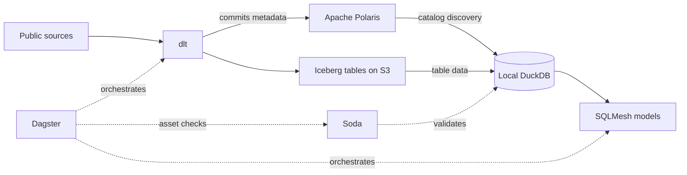
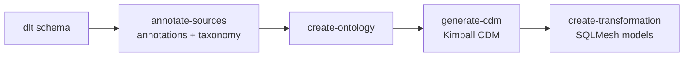

# Databox

[](https://github.com/Doctacon/databox/actions/workflows/ci.yaml)
[](https://doctacon.github.io/databox/)
[](LICENSE)

A local-first ingestion and data-product platform with dlt-managed Iceberg
tables on AWS S3, an Apache Polaris catalog, and local DuckDB analytics. Databox
transforms data with SQLMesh, validates it with Soda, and orchestrates the
workflow with Dagster—without always-on infrastructure.

## Platform boundary

Databox owns reusable source ingestion, Polaris/Iceberg raw authority, generic
environmental models, platform health, and bounded versioned DuckDB artifacts.
Its canonical registry contains seven sources: six routine refresh sources plus
the explicit pinned AVONET snapshot. The public `databox_sources.usfws`
interface is provider-only and requires caller-owned targets.

The standalone [Rufous](https://github.com/Doctacon/rufous) birding application
consumes the twelve-relation `rufous_inputs_v1` artifact read-only and keeps its
application state, product models, APIs, media workflows, web app, and
deployment in its own repository. Databox does not launch or deploy Rufous, and
Rufous production remains disabled pending separate authorization.

See the [data-product boundary](.10x/specs/databox-rufous-data-product-boundary.md),
[artifact exporter](scripts/platform/export_rufous_product.py), and
[repository split decision](.10x/decisions/split-rufous-into-standalone-repository.md).


```mermaid
flowchart LR
    sources[Public sources] --> dlt[dlt]
    dlt --> iceberg[Iceberg tables on S3]
    dlt -->|commits metadata| polaris[Apache Polaris]
    polaris -->|catalog discovery| duckdb[(Local DuckDB)]
    iceberg -->|table data| duckdb
    duckdb --> sqlmesh[SQLMesh models]
    soda[Soda] -. validates .-> duckdb
    dagster[Dagster] -. orchestrates .-> dlt
    dagster -. orchestrates .-> sqlmesh
    dagster -. asset checks .-> soda
```

## From source to model

New dlt sources move through a reviewable, agent-guided modeling workflow:


```mermaid
flowchart LR
    schema[dlt schema] --> annotate["annotate-sources<br/>annotations + taxonomy"]
    annotate --> ontology[create-ontology]
    ontology --> cdm["generate-cdm<br/>Kimball CDM"]
    cdm --> transform["create-transformation<br/>SQLMesh models"]
```

The project skills—[`annotate-sources`](.pi/skills/annotate-sources/SKILL.md),
[`create-ontology`](.pi/skills/create-ontology/SKILL.md),
[`generate-cdm`](.pi/skills/generate-cdm/SKILL.md), and
[`create-transformation`](.pi/skills/create-transformation/SKILL.md)—turn raw
schemas into business-aware warehouse models before transformation SQL is
written. [See the workflow](docs/source-layout.md#adding-model-behavior).

## Quickstart

Prerequisites: Python 3.12+, [uv](https://docs.astral.sh/uv/), and
[Task](https://taskfile.dev/).

### Evaluate without live providers

```bash
git clone https://github.com/Doctacon/databox.git
cd databox
task install   # creates .env from .env.example when absent
task ci
```

After the initial dependency install, source tests replay recorded responses, so
`task ci` needs neither provider credentials nor a populated warehouse.

### Build the local warehouse

After `task install`, configure the Polaris client, AWS S3 bucket/writer,
`EBIRD_API_TOKEN`, `NOAA_API_TOKEN`, and `XENO_CANTO_API_KEY` values documented
in `.env.example`. Start the local catalog, bootstrap the pinned AVONET snapshot
once, then refresh the routine sources:

```bash
$EDITOR .env
mkdir -p data .dagster
docker compose --env-file .env -f compose.iceberg.yml up -d
curl --fail --silent http://127.0.0.1:8182/q/health/ready
DAGSTER_HOME="$PWD/.dagster" PYTHONPATH="$PWD" \
  uv run dg launch --target-path packages/databox --job avonet_ingest
task full-refresh   # ingest Iceberg raw tables, then build local SQLMesh models
uv run python scripts/platform/export_rufous_product.py  # optional consumer artifact
```

AVONET is intentionally excluded from routine refreshes. See the
[operations runbook](docs/runbook.md#rebuild-local-warehouse-from-sources).

The Compose stack runs localhost-only Polaris with a PostgreSQL metadata backend;
the authoritative Iceberg data and metadata files remain in AWS S3. It also
includes the official open-source Polaris Console at <http://127.0.0.1:8080>,
built from a pinned Apache `polaris-tools` revision and connected to the Polaris
API on port 8181.

## Protected integration verification

Ordinary CI is credential-free and never contacts live providers or publishes to
S3. Maintainers can manually dispatch
[`Polaris Iceberg integration`](.github/workflows/polaris-iceberg-integration.yaml)
through its protected GitHub environment. It runs each of the six routine
sources independently with GitHub OIDC, disposable Polaris credentials, and a
source-scoped `integration/<run>/<attempt>/<source>/warehouse` prefix. The
[first complete passing run](.10x/evidence/2026-09-03-protected-polaris-source-matrix.md)
verified all six real provider-to-Iceberg paths without targeting the normal
`warehouse/` prefix.

## Learn more

- [Documentation and data dictionary](https://doctacon.github.io/databox/)
- [Architecture decisions](docs/adr/)
- [Configuration](docs/configuration.md)
- [Commands](docs/commands.md)
- [Adding a source](docs/new-source.md)
- [Forking and rebranding Databox](docs/template.md)

## License

[MIT](LICENSE)
