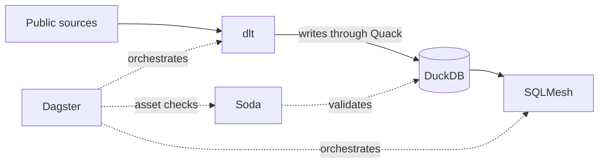
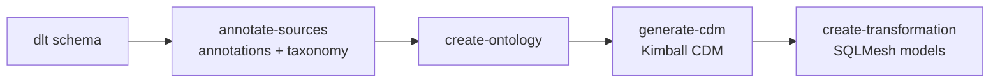

# Databox

[](https://github.com/Doctacon/databox/actions/workflows/ci.yaml)
[](https://doctacon.github.io/databox/)
[](LICENSE)

A local-first data warehouse built around DuckDB. Databox ingests public data
with dlt, coordinates concurrent writes through Quack, transforms it with
SQLMesh, validates it with Soda, and orchestrates the workflow with
Dagster—without always-on infrastructure.


```mermaid
flowchart LR
    sources[Public sources] --> dlt[dlt]
    dlt -->|writes through Quack| duckdb[(DuckDB)]
    duckdb --> sqlmesh[SQLMesh]
    soda[Soda] -. validates .-> duckdb
    dagster[Dagster] -. orchestrates .-> dlt
    dagster -. orchestrates .-> sqlmesh
    dagster -. asset checks .-> soda
```

## From source to model

New dlt sources move through a reviewable, agent-guided modeling workflow:


```mermaid
flowchart LR
    schema[dlt schema] --> annotate["annotate-sources<br/>annotations + taxonomy"]
    annotate --> ontology[create-ontology]
    ontology --> cdm["generate-cdm<br/>Kimball CDM"]
    cdm --> transform["create-transformation<br/>SQLMesh models"]
```

The project skills—[`annotate-sources`](.pi/skills/annotate-sources/SKILL.md),
[`create-ontology`](.pi/skills/create-ontology/SKILL.md),
[`generate-cdm`](.pi/skills/generate-cdm/SKILL.md), and
[`create-transformation`](.pi/skills/create-transformation/SKILL.md)—turn raw
schemas into business-aware warehouse models before transformation SQL is
written. [See the workflow](docs/source-layout.md#adding-model-behavior).

The included [Rufous bird app](docs/rufous-operations.md) is a reference
consumer of the warehouse, not the core of the project.

## Quickstart

Prerequisites: Python 3.12+, [uv](https://docs.astral.sh/uv/), and
[Task](https://taskfile.dev/). Node.js 22+ and npm are only needed for
Rufous.

### Evaluate without live providers

```bash
git clone https://github.com/Doctacon/databox.git
cd databox
task install   # creates .env from .env.example when absent
task ci
```

After the initial dependency install, source tests replay recorded responses, so
`task ci` needs neither provider credentials nor a populated warehouse.

### Build the local warehouse

Configure the source credentials in `.env`. For a new database, bootstrap the
pinned AVONET snapshot once, then refresh the routine sources:

```bash
$EDITOR .env
mkdir -p data .dagster
DAGSTER_HOME="$PWD/.dagster" PYTHONPATH="$PWD" \
  uv run dg launch --target-path packages/databox --job avonet_ingest
task full-refresh   # ingest and transform into data/databox.duckdb
task dagster:dev    # inspect assets at http://localhost:3000
```

AVONET is intentionally excluded from routine refreshes. See the
[operations runbook](docs/runbook.md#rebuild-local-warehouse-from-sources).

## Learn more

- [Documentation and data dictionary](https://doctacon.github.io/databox/)
- [Architecture decisions](docs/adr/)
- [Configuration](docs/configuration.md)
- [Commands](docs/commands.md)
- [Adding a source](docs/new-source.md)
- [Forking and rebranding Databox](docs/template.md)

## License

[MIT](LICENSE)
