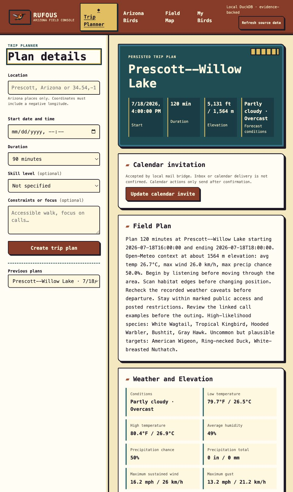
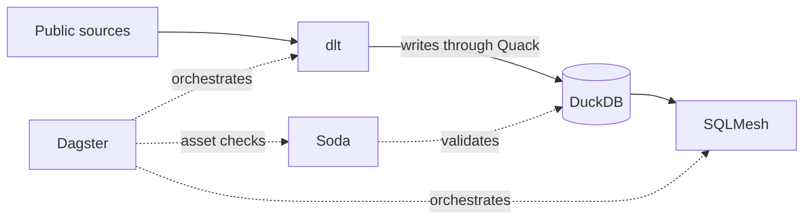
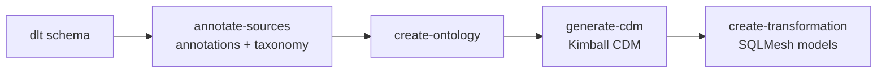

# Databox

[](https://github.com/Doctacon/databox/actions/workflows/ci.yaml)
[](https://doctacon.github.io/databox/)
[](LICENSE)

A local-first data warehouse built around DuckDB. Databox ingests public data
with dlt, coordinates concurrent writes through Quack, transforms it with
SQLMesh, validates it with Soda, and orchestrates the workflow with
Dagster—without always-on infrastructure.

## Rufous



Rufous is the user-facing birding product built on Databox: a React/TypeScript
interface for interactive Arizona encounter maps, personal collections,
explicit source refresh, watched-bird alerts, and evidence-grounded trip
planning.

`React/TypeScript -> typed FastAPI APIs -> DuckDB warehouse -> bounded Google ADK workflow and strict-schema model inference`

The full Rufous warehouse experience is local-first and loopback-only; DuckDB
and model credentials stay behind the local typed API. A separate browser-only
public export is deployed at [rufous.loughondata.com](https://rufous.loughondata.com/)
with static, privacy-reviewed data and no database or model credentials.

Rufous does not estimate encounter probability. Its recently reported group
contains species with distinct eBird submissions in the configured eBird
lookback (30 days back by default, with both boundary dates included); its GBIF
occurrence-context group contains species without qualifying eBird submissions
in that lookback. The first group sorts by eligible submission count, newest
report, then species name; the
second sorts by distinct occurrence count, newest occurrence date or year, then
species name. Each source record counts once. The planner records the exact date
range in its trace; all eBird and GBIF evidence used for ranking is within the
enforced 50 km radius.

```bash
task full-refresh       # populate routine sources after the one-time bootstrap below
task app:dev           # FastAPI :8000 + Vite :5173 with hot reload
task app:check         # typecheck + tests + build + configured bundle audit
task app:audit-bundle  # audit an existing build
task app               # build and serve at http://127.0.0.1:8000
```

`task verify` is a bounded smoke refresh for pipeline verification; it is not the
data-population step for Rufous.

See the [Rufous operations guide](docs/rufous-operations.md) for local setup and
operator-only delivery procedures.


```mermaid
flowchart LR
    sources[Public sources] --> dlt[dlt]
    dlt -->|writes through Quack| duckdb[(DuckDB)]
    duckdb --> sqlmesh[SQLMesh]
    soda[Soda] -. validates .-> duckdb
    dagster[Dagster] -. orchestrates .-> dlt
    dagster -. orchestrates .-> sqlmesh
    dagster -. asset checks .-> soda
```

## From source to model

New dlt sources move through a reviewable, agent-guided modeling workflow:


```mermaid
flowchart LR
    schema[dlt schema] --> annotate["annotate-sources<br/>annotations + taxonomy"]
    annotate --> ontology[create-ontology]
    ontology --> cdm["generate-cdm<br/>Kimball CDM"]
    cdm --> transform["create-transformation<br/>SQLMesh models"]
```

The project skills—[`annotate-sources`](.pi/skills/annotate-sources/SKILL.md),
[`create-ontology`](.pi/skills/create-ontology/SKILL.md),
[`generate-cdm`](.pi/skills/generate-cdm/SKILL.md), and
[`create-transformation`](.pi/skills/create-transformation/SKILL.md)—turn raw
schemas into business-aware warehouse models before transformation SQL is
written. [See the workflow](docs/source-layout.md#adding-model-behavior).

## Quickstart

Prerequisites: Python 3.12+, [uv](https://docs.astral.sh/uv/), and
[Task](https://taskfile.dev/). Node.js 22+ and npm are only needed for
Rufous.

### Evaluate without live providers

```bash
git clone https://github.com/Doctacon/databox.git
cd databox
task install   # creates .env from .env.example when absent
task ci
```

After the initial dependency install, source tests replay recorded responses, so
`task ci` needs neither provider credentials nor a populated warehouse.

### Build the local warehouse

After `task install`, configure `EBIRD_API_TOKEN`, `NOAA_API_TOKEN`, and
`XENO_CANTO_API_KEY` in `.env`. Live trip-plan synthesis also requires
`CF_WORKERS_AI_API_KEY` and `CF_WORKERS_AI_ACCOUNT_ID`; keep the example's
allowlisted model selector. For a new database, bootstrap the pinned AVONET
snapshot once, then refresh the routine sources:

```bash
$EDITOR .env
mkdir -p data .dagster
DAGSTER_HOME="$PWD/.dagster" PYTHONPATH="$PWD" \
  uv run dg launch --target-path packages/databox --job avonet_ingest
task full-refresh   # ingest and transform into data/databox.duckdb
task app            # build and serve Rufous at http://127.0.0.1:8000
```

AVONET is intentionally excluded from routine refreshes. See the
[operations runbook](docs/runbook.md#rebuild-local-warehouse-from-sources).

The Iceberg Compose stack includes the official open-source Polaris Console at
<http://127.0.0.1:8080>. It is built from a pinned Apache `polaris-tools`
revision and connects to the localhost-only Polaris API on port 8181.

## Learn more

- [Documentation and data dictionary](https://doctacon.github.io/databox/)
- [Architecture decisions](docs/adr/)
- [Configuration](docs/configuration.md)
- [Commands](docs/commands.md)
- [Adding a source](docs/new-source.md)
- [Forking and rebranding Databox](docs/template.md)

## License

[MIT](LICENSE)
