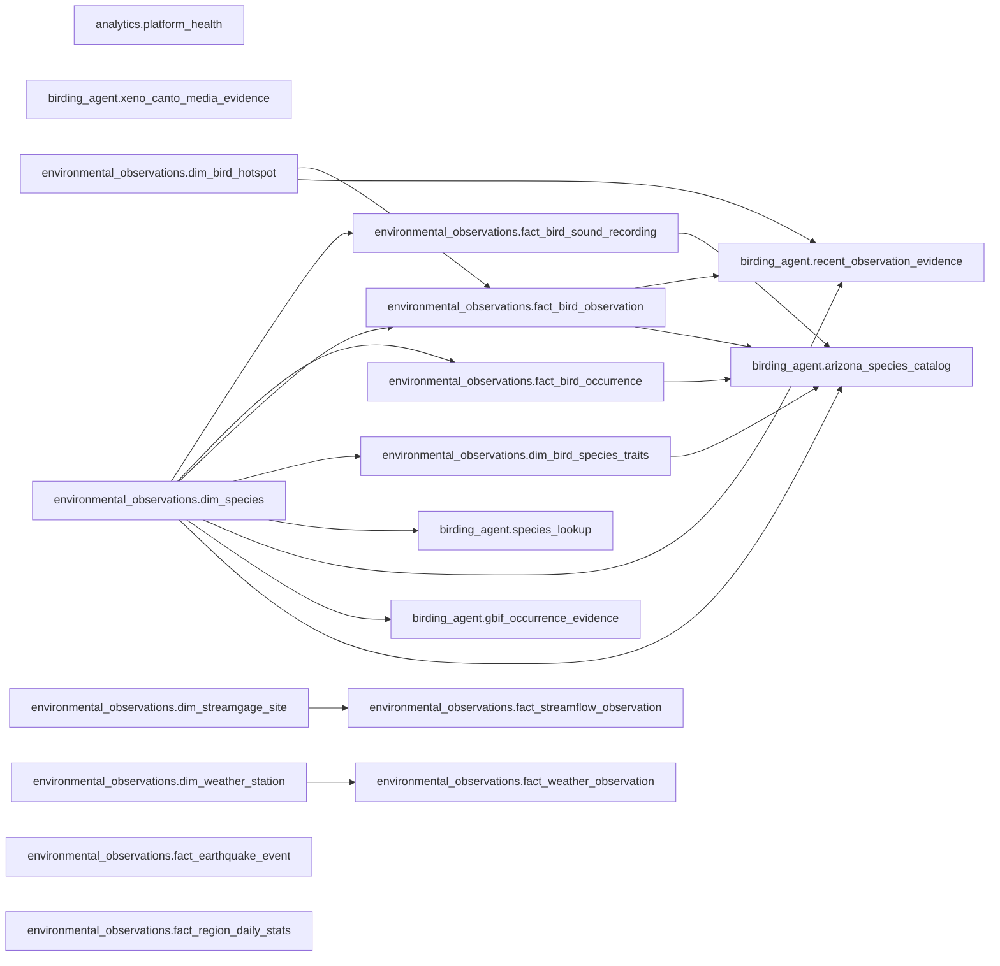

# Lineage

Full model dependency graph across all SQLMesh projects. Each node links to its data-dictionary page.

```mermaid
graph LR
    n0["analytics.platform_health"]
    n1["birding_agent.arizona_species_catalog"]
    n2["birding_agent.gbif_occurrence_evidence"]
    n3["birding_agent.recent_observation_evidence"]
    n4["birding_agent.species_lookup"]
    n5["birding_agent.xeno_canto_media_evidence"]
    n6["environmental_observations.dim_bird_hotspot"]
    n7["environmental_observations.dim_bird_species_traits"]
    n8["environmental_observations.dim_species"]
    n9["environmental_observations.dim_streamgage_site"]
    n10["environmental_observations.dim_weather_station"]
    n11["environmental_observations.fact_bird_observation"]
    n12["environmental_observations.fact_bird_occurrence"]
    n13["environmental_observations.fact_bird_sound_recording"]
    n14["environmental_observations.fact_earthquake_event"]
    n15["environmental_observations.fact_region_daily_stats"]
    n16["environmental_observations.fact_streamflow_observation"]
    n17["environmental_observations.fact_weather_observation"]
    n7 --> n1
    n8 --> n1
    n11 --> n1
    n12 --> n1
    n13 --> n1
    n8 --> n2
    n6 --> n3
    n8 --> n3
    n11 --> n3
    n8 --> n4
    n8 --> n7
    n6 --> n11
    n8 --> n11
    n8 --> n12
    n8 --> n13
    n9 --> n16
    n10 --> n17

    click n0 "analytics/platform_health.md"
    click n1 "birding_agent/arizona_species_catalog.md"
    click n2 "birding_agent/gbif_occurrence_evidence.md"
    click n3 "birding_agent/recent_observation_evidence.md"
    click n4 "birding_agent/species_lookup.md"
    click n5 "birding_agent/xeno_canto_media_evidence.md"
    click n6 "environmental_observations/dim_bird_hotspot.md"
    click n7 "environmental_observations/dim_bird_species_traits.md"
    click n8 "environmental_observations/dim_species.md"
    click n9 "environmental_observations/dim_streamgage_site.md"
    click n10 "environmental_observations/dim_weather_station.md"
    click n11 "environmental_observations/fact_bird_observation.md"
    click n12 "environmental_observations/fact_bird_occurrence.md"
    click n13 "environmental_observations/fact_bird_sound_recording.md"
    click n14 "environmental_observations/fact_earthquake_event.md"
    click n15 "environmental_observations/fact_region_daily_stats.md"
    click n16 "environmental_observations/fact_streamflow_observation.md"
    click n17 "environmental_observations/fact_weather_observation.md"
```
